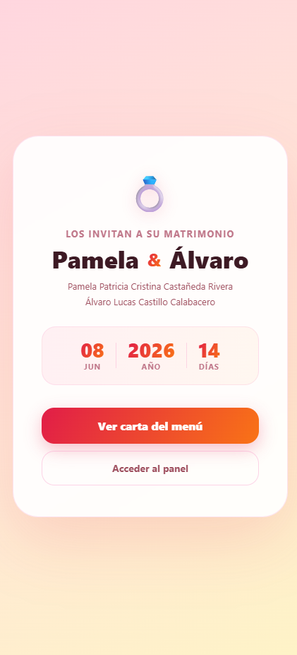
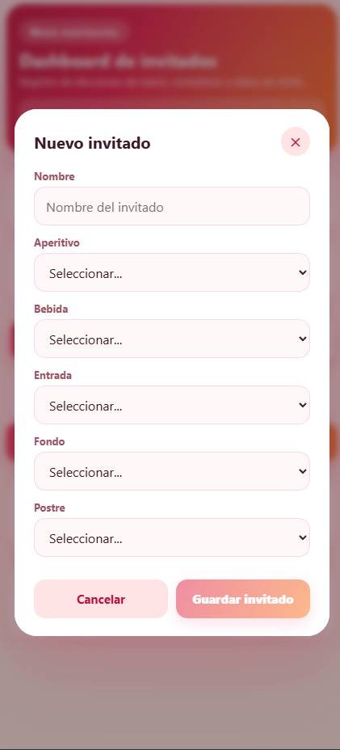
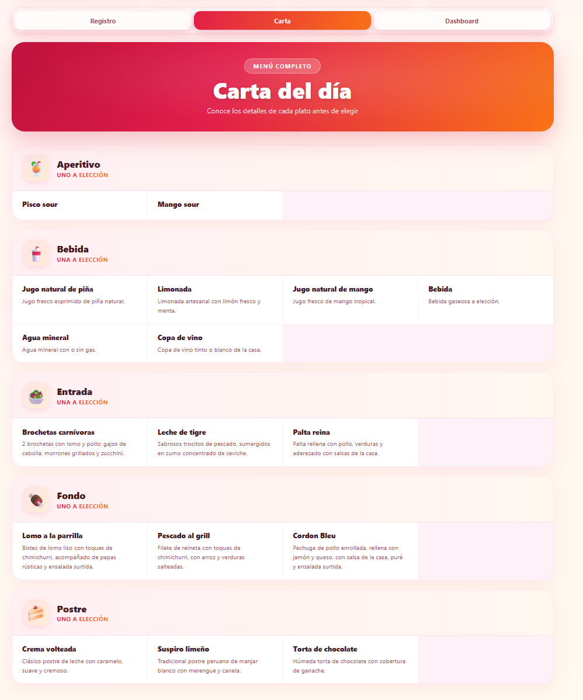
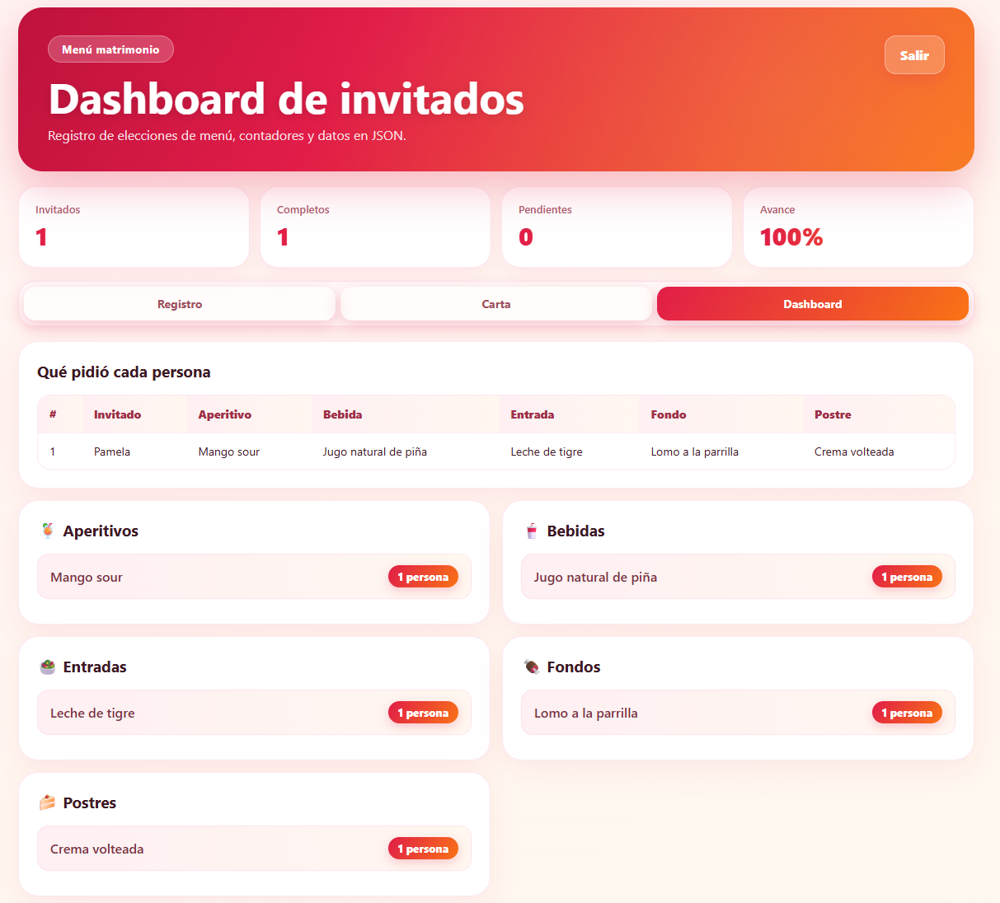
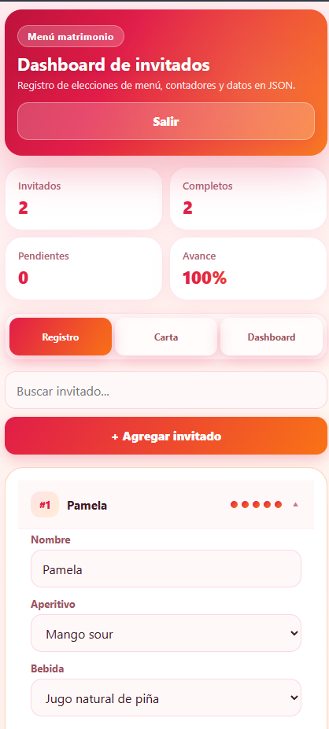
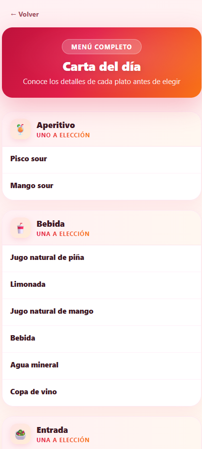
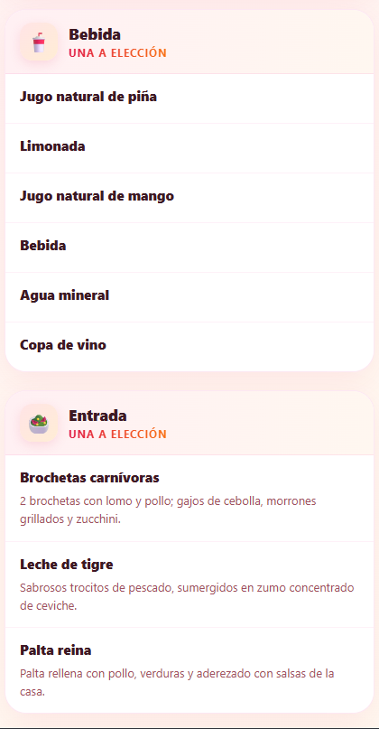

# 💍 Menú Matrimonio

Aplicación web para registrar y gestionar el menú de cada invitado de un matrimonio. Desarrollada con React + Vite, Firebase Auth y Firestore en tiempo real.

**[Ver app en vivo →](https://alvarocc96.github.io/menu-matrimonio/)**

---

## Capturas

### Landing


### Registro de invitados


### Carta del menú


### Dashboard de resultados


### Responsive — Registro y Carta

| | |
|---|---|
|  |  |



---

## Funcionalidades

- 🔐 **Login con Firebase Auth** — acceso con email y contraseña
- 👥 **Registro de invitados** — agrega, edita y elimina invitados
- 🍽️ **Selección de menú** — aperitivo, bebida, entrada, fondo y postre
- 📋 **Carta detallada** — descripción completa de cada plato
- 📊 **Dashboard en tiempo real** — tabla resumen y conteos por opción
- ☁️ **Sincronización en la nube** — datos guardados en Firestore, accesible desde cualquier dispositivo
- 📱 **Responsive** — funciona en móvil y escritorio

## Stack

| Tecnología | Uso |
|---|---|
| React + Vite | Frontend |
| Firebase Auth | Autenticación |
| Cloud Firestore | Base de datos en tiempo real |
| GitHub Actions | Deploy automático |
| GitHub Pages | Hosting |

## Desarrollo local

```bash
# Clonar el repo
git clone https://github.com/AlvaroCC96/menu-matrimonio.git
cd menu-matrimonio

# Instalar dependencias
npm install

# Crear archivo de entorno
cp .env.example .env
# → Completa las variables con tu config de Firebase

# Levantar servidor de desarrollo
npm run dev
```

## Variables de entorno

Crea un archivo `.env` basado en `.env.example` con tu configuración de Firebase:

```env
VITE_FIREBASE_API_KEY=
VITE_FIREBASE_AUTH_DOMAIN=
VITE_FIREBASE_PROJECT_ID=
VITE_FIREBASE_STORAGE_BUCKET=
VITE_FIREBASE_MESSAGING_SENDER_ID=
VITE_FIREBASE_APP_ID=
```

## Estructura del proyecto

```
src/
├── main.jsx                  # Entry point
├── App.jsx                   # Lógica principal + Firebase
├── styles.css                # Estilos globales
├── firebase.js               # Configuración Firebase
├── data/
│   ├── menuOptions.js        # Opciones de cada categoría
│   └── menuDetails.js        # Descripciones de los platos
├── utils/
│   └── guests.js             # Helpers de invitados
└── components/
    ├── LoginScreen.jsx
    ├── Header.jsx
    ├── Tabs.jsx
    ├── Stat.jsx
    ├── SelectField.jsx
    ├── GuestCard.jsx
    ├── RegisterView.jsx
    ├── DashboardView.jsx
    ├── Counter.jsx
    └── CartaView.jsx
```

## Personalizar el menú

Edita [`src/data/menuOptions.js`](src/data/menuOptions.js) para cambiar las opciones de cada categoría, y [`src/data/menuDetails.js`](src/data/menuDetails.js) para actualizar las descripciones de los platos.
